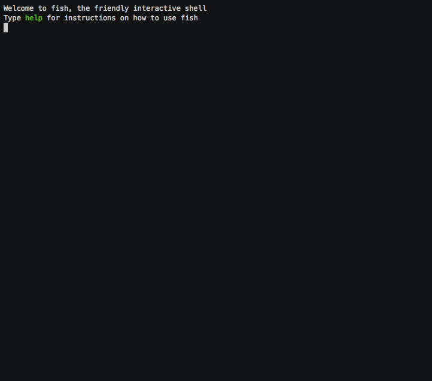

# tvst [](https://travis-ci.org/shahriar1/tvst)

> TV Shows Tracker (TVST) on command line




## Table of contents
  * [Install](#install)
  * [Upgrade](#upgrade)
  * [Usage](#usage)
    * [Schedule](#schedule)
      * [Examples](#schedule-examples)
        * [See all shows of today](#schedule-today)
        * [See all shows of tomorrow](#schedule-tomorrow)
        * [See all shows of yesterday](#schedule-yesterday)
        * [See all shows of a particular date](#schedule-by-date)
        * [See if tomorrow has a episode of a particular tv show](#schedule-tomorow-particular)
        * [See today's schedule of a particular country](#schedule-country)
    * [Next Episode](#next-episode)
      * [Examples](#next-episode-examples)
        * [See next episode's details of a particular show](#see-next-episode-details-of-a-particular-show)
    * [Previous Episode](#previous-episode)
      * [Examples](#previous-episode-examples)
        * [See previous episode's details of a particular show](#see-previous-episode-details-of-a-particular-show)
    * [Favorite Shows](#favorite-shows)
      * [Examples](#favroite-shows-examples)
        * [Add show(s) as your favorite](#add-shows-as-your-favorite)
        * [Remove show(s) from your favorite](#remove-shows-from-your-favorite)
        * [See schedules of all of your favorite shows](#get-schedule-of-all-of-your-favorite-shows)
    * [Help](#help)
    * [Version](#version)
  * [Credits](#credits)
  * [License](#license)


## Install <a name="install"></a>

Install with [npm](https://www.npmjs.com/):

```bash
npm install -g tvst
```
## Upgrade <a name="upgrade"></a>

```bash
npm update -g tvst
```

## Usage <a name="usage"></a>

```

  Usage: tvst [options] [command]


  Commands:

    schedule <date>  Show list of TV shows of a specific date
    ne <show-name>   Date & Air time of next episode of a show
    pe <show-name>   Date & Air time of previous episode of a show
    fav-add          Add TV shows in your favorite list
    fav-list         Show list of your favorite shows
    fav-remove       Remove show(s) from your favorite shows
    help [cmd]       display help for [cmd]

  TV Shows Tracker (TVST) On Command Line - For Developers

  Options:

    -h, --help     output usage information
    -V, --version  output the version number

```   


### Schedule - `schedule` <a name="schedule"></a>
```
tvst schedule <date>
```

#### Usage of schedule

```
$ tvst schedule --help

  Usage: tvst-schedule [options]

  Options:

    -h, --help              output usage information
    -c --country <country>  ISO Country Code - eg. US or GB etc.
    -f --filter <filter>    Filter By Show Name
```

#### Examples:<a name="schedule-examples"></a>

See all shows of today <a name="schedule-today"></a> :
```bash
tvst schedule today
```

See all shows of tomorrow <a name="schedule-tomorrow"></a> :
```bash
tvst schedule tomorrow
```

See all shows of yesterday <a name="schedule-yesterday"></a> :
```bash
tvst schedule yesterday
```

See all shows of a particular date <a name="schedule-by-date"></a> :
```bash
tvst schedule '2016-06-14'
```

See if tomorrow has a episode of a particular tv show <a name="schedule-tomorow-particular"></a> :
```bash
tvst schedule tomorrow -f 'game of thrones'
```

See today's schedule of a particular country <a name="schedule-country"></a> :
```bash
tvst schedule today -c GB
```


## Next Episode - ne
```
tvst ne <show-name>
```

#### Example

Get next episode schedule with details of a specific show - `tvst ne 'game of thrones'`

###### If you're not sure about spelling of a specific show name, just guess, it will return list of possible shows


###### If any show has no update of next episode then it returns details of previous episode


## Previous episode - pe


```
tvst pe <show-name>
```

#### Example

Get next episode schedule with details of a specific show - `tvst pe 'game of thrones'`

###### If you're not sure about spelling of a specific show name, just guess, it will return list of possible shows

####


### _More awesome features are in development_ :smile:


## Credits
###### [TVMaze API](http://tvmaze.com/api)


## License

The MIT @ [Shahriar Mahmood](https://github.com/shahriar1)
